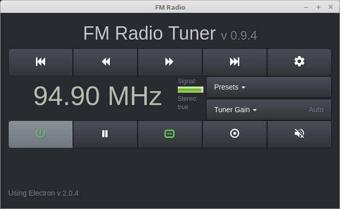

# FM Radio Tuner

A simple cross-platform Electron app for listening to FM radio using an RTL2832U based USB dongle.

## Features:
- Tested on Windows 10 Windows 7, MacOS 10.13, Ubuntu 18.04 and Fedora 28.
- Supports all tuners supported by [rtl-sdr](http://sdr.osmocom.org/trac/wiki/rtl-sdr)
- Stereo decoding.
- Good sound quality at higher sample rates (you be the judge).
- Plays audio locally and on local HTTP server for remote listening.
- Scan for stations.
- Add station presets.
- Record audio in lossless FLAC format.
- Fully configurable.
- Prebuilt for x64 Windows, Mac and Linux.

## Hardware Requirements
### Intel CPUs
- Dual core CPU (tested and runs on a 2008 Pentium dual core T4200 laptop).
- 1.5GB RAM.
- Max sample rate for Intel is usually 2.56Msps.
### ARM CPU
- Runs well on ASUS Tinkerboard. Tested using Armbian and TinkerOS. A fan will be required to run at higher sample rates to avoid overheating and stability issues.
- Does not run on Raspberry Pi but should run on any SBC with enough RAM and CPU grunt.

## Running
Download required package from the [releases](https://github.com/dmooney65/fmradio/releases) page and install.
### Windows
Requires dongle to be properly set up using [Zadig](https://zadig.akeo.ie/).
### Mac
Install [Homebrew](https://brew.sh/) and run `brew install flac rtl-sdr`. Install the DMG package as normal.
### Linux
Requirements will be installed automatically for deb and rpm packages. 
For AppImage, librtlsdr0 (debian/ubuntu) or rtl-sdr (Fedora/CentOS etc.) must be installed.

## Building

Install dependencies (see below), clone/copy the repo and run `npm install`, then `npm start` from the cloned directory. If `npm install` fails, it is usually necessary to delete the `node_modules` directory before retrying.

### Linux
Requires librtlsdr-dev (Debian/Ubuntu) or rtl-sdr-devel (Fedora etc.), libflac-dev (Debian/Ubuntu) or flac-devel (Fedorra etc.).

### Mac
Install [Homebrew](https://brew.sh/) and run `brew install flac rtl-sdr`.

### Windows
Complicated - will document at some point.

## Acknowledgements
This app is essentially an Electron rewrite/adaption of the [Radio Reciever](https://github.com/google/radioreceiver) Chrome app.

